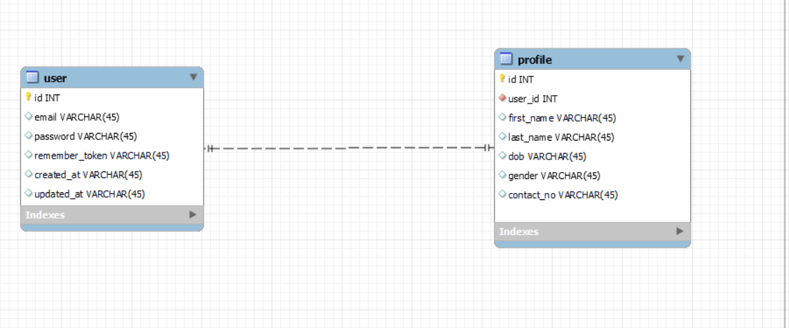
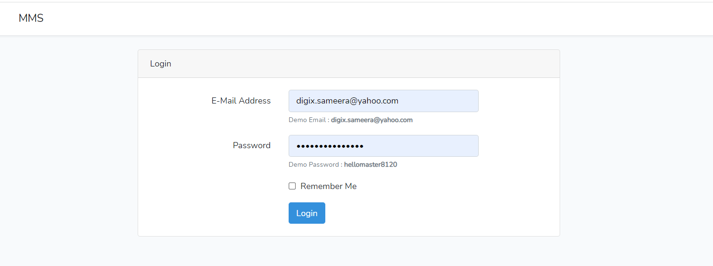
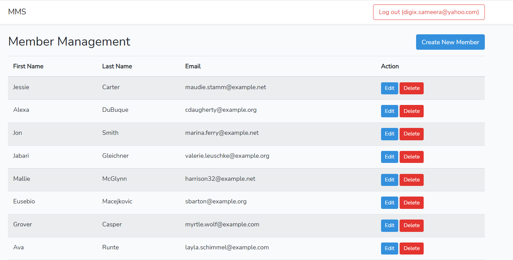

# MEMBER MANAGEMENT SYSTEM (MMS)

`MMS` is PHP Laravel MSYQL + AJAX Backend Project Develop for CMG.It facilitates to manage Members Management.




## Prerequisites 
1. Composer (Latest)
2. Node Environment 
3. MYSQL , MYSQL Workbench
4. Command Prompt or VS Code


# Getting Start

If you would still prefer to do the installation manually, follow these steps:

### 1. Clone the repo

```bash
git clone https://github.com/DDSameera/lr_member_mis.git
cd lr_member_mis
```

### 2.Install the dependencies:

```bash
composer install
npm install
npm audit fix
npm run dev
```

### 3. Set the configurations:

- Rename `.env.example` file to `.env`
- Go to `.env` file and add database details

Example

#### .env
```
DB_CONNECTION=mysql
DB_HOST=127.0.0.1
DB_PORT=3306
DB_DATABASE=laravel_member_mis
DB_USERNAME=root
DB_PASSWORD=
```


###  3. Application Key Generate
#### Run this command ```php artisan key:generate```

### 5. Run Migration & Seeds
```
php artisan migrate:fresh --seed
```
### 6. Start Server
### Server IP :  http://127.0.0.1:8000
- Demo Email : digix.sameera@yahoo.com
- Demo Password : hellomaster8120
```
php artisan serve
```
### 7. Clear Cache
```
php artisan optimize:clear
```

That's all
